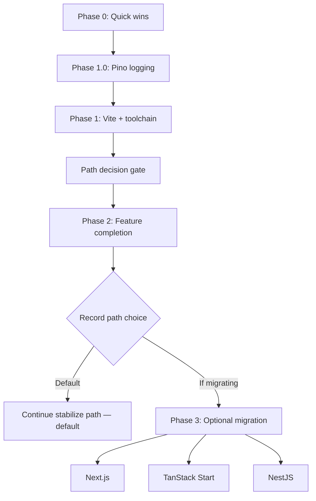

# PET Freelancer — Revival Plan

> Living document for reviving this project. Check off items as they are completed.
> Last updated: 2026-07-08

---

## Purpose

This app tracks freelance earnings per month, per year, and per client. Revival means making it trustworthy to run locally, safe to extend, and pleasant to use — without committing to a full rewrite upfront.

**Recommended sequence:** Quick wins → server logging (Pino) → Vite modernization → feature completion → optional full-stack migration (only if needed).

---

## Current State (baseline)

| Area | Status |
|------|--------|
| Frontend | React 18 + CRA (`react-scripts`), strict TypeScript, FSD-ish layout |
| Backend | Express 4, Mongoose 6, JWT auth, ~15 API routes (plain JavaScript) |
| Data | MongoDB — Users, Clients, Projects (soft delete) |
| Tests | ~20 client tests, 15 server integration tests |
| CI | GitHub Actions (lint, typecheck, tests) + CodeQL |
| Deploy | Heroku-style monolith (Express serves CRA build in production) |

### What already works

- [x] Auth flow (login / signup / logout + JWT)
- [x] Dashboard with monthly earnings chart and totals
- [x] Projects page: search, sort, pagination, add / edit / delete via modals
- [x] Clients page: aggregated stats, sort, expand / collapse
- [x] Entity-level API layer (`entities/*/api`) on shared `apiClient`
- [x] React Query + React Router loaders / actions

### Known issues to address (see Phase 0)

- [x] "Earnings by Clients" chart on dashboard (listed broken in README)
- [x] `getUser` may sign JWT with excluded `_id`
- [x] `/clients/withProjectData` missing `userId` filter (data leak risk)
- [x] Project PATCH may create client with `req.body.user` instead of `req.userId`
- [x] API path casing: frontend `withprojectdata` vs server `withProjectData`
- [x] `upsert: true` on PATCH updates (can create docs unintentionally)
- [x] Root `npm run check-types` has no root `tsconfig.json`
- [x] React Query `staleTime: Infinity` hides stale data

---

## Revival Approaches

Four viable paths. **Only one primary path should be active at a time** after the Phase 3 path decision gate (Phase 1.0 + 1.1); the others stay as documented alternatives.

### A. Stabilize in place *(recommended primary path)*

Keep Express + React, modernize incrementally.

| Pros | Cons |
|------|------|
| Smallest scope; FSD architecture preserved | Still a split client/server repo layout |
| Fastest path to a working, trustworthy app | CRA must be replaced (Phase 1) |
| Shared types can bridge FE/BE without full rewrite | Two deploy units unless monolith kept |

**Phases:** 0 Quick wins → 1 Pino + Vite + server TS → 2 Feature completion

---

### B. Full Next.js (App Router)

Single deploy; API routes or Server Actions replace Express.

| Pros | Cons |
|------|------|
| One modern full-stack framework | React Router loaders/actions must be rewritten |
| Vercel deploy is straightforward | FSD `app/` layer naming conflict (rename to `application/`) |
| Built-in routing, SSR available | MongoDB connection model changes for serverless |

**When to choose:** After **Phase 1.0 (Pino)** and **Phase 1.1 (Vite)** are complete (path decision gate), if you want SSR, Vercel hosting, or a single codebase boundary. Phase 3 migration work still starts after Phase 2.

- [ ] Decision recorded (date / rationale)
- [ ] Spike: map current routes → Next.js App Router
- [ ] Spike: MongoDB connection strategy (pooled vs per-request)
- [ ] Migration plan drafted

---

### C. TanStack Start

File-based routing + SSR; natural fit with existing TanStack Query usage.

| Pros | Cons |
|------|------|
| Aligns with current React Query patterns | Smaller ecosystem than Next.js |
| Type-safe loaders close to current mental model | Near-full routing rewrite |
| Modern stack without Next opinions | Express remains separate unless folded in |

**When to choose:** After **Phase 1.0 (Pino)** and **Phase 1.1 (Vite)** are complete (path decision gate), if you prefer the TanStack ecosystem over Next.js. Phase 3 migration work still starts after Phase 2.

- [ ] Decision recorded (date / rationale)
- [ ] Spike: TanStack Start + current FSD folder layout
- [ ] Spike: API boundary (keep Express vs Start server routes)
- [ ] Migration plan drafted

---

### D. Express → NestJS

TypeScript-native backend with modules, guards, validation pipes.

| Pros | Cons |
|------|------|
| DI, Swagger, class-validator map cleanly to JWT auth | Overkill for ~33 server files today |
| Scales if invoicing, webhooks, multi-tenant added | Full backend rewrite |
| Does not solve CRA deprecation alone | Learning curve |

**When to choose:** After **Phase 1.0 (Pino)** and **Phase 1.1 (Vite)** are complete (path decision gate), if backend complexity will grow significantly (payments, webhooks, multi-tenant SaaS). Phase 3 migration work still starts after Phase 2.

- [ ] Decision recorded (date / rationale)
- [ ] Spike: NestJS module map from current `server/resources/*`
- [ ] Spike: shared Zod/DTO package with frontend
- [ ] Migration plan drafted

---

## Roadmap Overview



| Phase | Goal | Status |
|-------|------|--------|
| **0** | Make it run, fix critical bugs, quick wins | Sign-off in progress |
| **1** | Pino logging, CRA → Vite, server TS, shared types, CI | Not started |
| **2** | Complete core product features from README | Not started |
| **3** | Path decision; default: stay on stabilize — optional Next.js / TanStack Start / NestJS migration | Deferred |

---

## Phase 0 — Quick Wins *(first implementable step)*

**Goal:** Trustworthy local dev, critical bugs fixed, dead weight removed, tests and types tooling unblocked.

**Exit criteria:** App runs locally; `validate` and tests pass in CI; known security/data bugs fixed; clients chart verified.

### 0.1 Environment & local run

- [x] Add `server/.env.example` (DB URI, `ACCESS_TOKEN_SECRET`, `JWT_EXPIRES_IN`, `PORT`)
- [x] Add `client/.env.example` if needed (proxy / API base URL)
- [x] Document local setup in README (MongoDB, `npm run dev`, test DB)
- [x] Verify `npm run dev` starts client + server without errors

### 0.2 Critical bug fixes

- [x] **Auth `getUser`:** stop excluding `_id` from select, or use `req.userId` for JWT payload
- [x] **`/clients/withProjectData`:** add `user: req.userId` to `$match` stage
- [x] **Project PATCH:** use `req.userId` when creating a new client (not `req.body.user`)
- [x] **API path casing:** align frontend `clients/withprojectdata` ↔ server `/withProjectData`
- [x] **Remove `upsert: true`** from project PATCH and generic CRUD `updateOne` (or scope explicitly)
- [x] **Clients chart:** debug and fix dashboard "Earnings by Clients" (min chart height when empty, populated `client.name`)
- [x] Add unit test for `getEarningsByClients` in `dashboard.helpers.ts`

### 0.3 Dependency & tooling cleanup

- [x] Remove unused `chart.js` and `react-chartjs-2` from `client/package.json`
- [x] Audit `react-spring` usage — keep (used in Modal, Notification, Dropdown)
- [x] Add root `tsconfig.json` (extends `client/`) so `npm run check-types` works
- [x] Fix ESLint TS `parserOptions.project` to point at correct tsconfig
- [x] Change React Query default `staleTime` from `Infinity` to a reasonable value (e.g. 5 min); keep explicit invalidation on mutations

### 0.4 Test & CI quick wins

- [x] Add server test: `GET /api/v1/users/getUser` returns valid refreshed token
- [x] Add server test: `GET /api/v1/clients/withProjectData` returns only current user's data
- [x] Add server test: `GET /api/v1/projects/forChart` with `months` filter
- [x] Add GitHub Actions workflow: `lint` + `check-types` + `server:test` + `client:test`
- [x] All existing tests pass locally after bug fixes

### 0.5 Phase 0 sign-off

- [ ] Manual smoke test: login → dashboard (both charts) → add project → projects list → clients page
- [x] README refactored to production quality; historical TODOs moved to `docs/BACKLOG.md`
- [ ] Phase 0 PR merged / tagged

**Phase 0 status:** `Sign-off in progress`

**Notes:**

```
Phase 0.1 (branch revival/phase-0-1-local-dev-setup): env templates, dotenv path fix,
CRA proxy aligned to server PORT 6000, README local setup section.
Full `npm run dev` verified 2026-07-08: MongoDB connected, server on :6000, CRA on :3000,
proxy to API returns expected 401 without auth; client compiles with warnings only.

Phase 0.2 (branch revival/phase-0-2-critical-bug-fixes): auth getUser JWT fix,
withProjectData user scoping, project PATCH user/upsert fixes, API path casing,
clients chart empty-state height, getEarningsByClients unit test, server tests for
getUser and withProjectData.

Phase 0.3 (branch revival/phase-0-3-tooling-cleanup): removed unused chart.js deps,
root tsconfig for check-types, ESLint parserOptions fix, React Query staleTime 5 min,
react-spring kept (Modal, Notification, Dropdown).

Phase 0.4 (branch revival/phase-0-4-test-ci): forChart server integration tests
(months filter, user scoping, all-time), GitHub Actions CI workflow (lint,
check-types, server:test, client:test), ESLint mocha env for server tests,
DashboardTotals snapshot stabilized with fake timers.

Phase 0.5 (branch revival/phase-0-5-sign-off): README refactored to production
quality; historical TODOs moved to docs/BACKLOG.md. Automated checks: 15/15 server
tests, dev servers boot (client :3000, server :6000). Manual browser walkthrough
still required before merge.
```

---

## Phase 1 — Pino logging, Vite & toolchain modernization

**Goal:** Structured server logging with Pino; replace CRA with Vite; begin server TypeScript migration; establish shared API contracts; reliable CI.

**Prerequisite:** Phase 0 complete.

**Exit criteria:** Pino replaces ad-hoc `console.log` / file logging on the server; `npm run dev` uses Vite; production build works; server compiles with TS (or hybrid); shared types in use; CI green.

**Note:** **Path decision gate:** do not record a Phase 3 choice (Next.js, TanStack Start, NestJS, or stay on stabilize) until **Phase 1.0 (Pino)** and **Phase 1.1 (Vite)** are complete. Phase 3 migration work still waits for Phase 2. Observability on the current Express app makes migration spikes and production debugging easier regardless of which frontend route wins.

### 1.0 Structured logging (Pino) *(do first in Phase 1)*

- [ ] Add `pino`, `pino-http`, and `pino-pretty` (dev) to `server/package.json`
- [ ] Create `server/utils/logger.js` (or `logger.ts` if TS conversion starts here): JSON in production, pretty-print in development
- [ ] Replace `console.log(err.stack)` in `errorHandler` — log 5xx as `error`, 4xx as `warn` or skip; no stack dumps for expected validation errors in tests
- [ ] Replace or supplement `morgan` with `pino-http` for request logging (method, url, status, response time)
- [ ] Migrate or retire custom `logEvents` / `server/logs/*.log` file writes — route through Pino (file transport optional)
- [ ] Quiet logging when `NODE_ENV=test` (keep Mocha output readable; still log unexpected 5xx)
- [ ] Add `LOG_LEVEL` to `server/.env.example` (e.g. `info` in prod, `debug` locally)
- [ ] Verify server tests still pass with no noisy expected-error stacks

### 1.1 CRA → Vite migration

- [ ] Scaffold Vite config (`vite.config.ts`) with path aliases matching `client/tsconfig` `baseUrl`
- [ ] Move `public/` and `index.html` to Vite conventions
- [ ] Replace `react-scripts` scripts with `vite`, `vite build`, `vitest`
- [ ] Configure dev proxy to Express (`localhost:5000` / `6000`)
- [ ] Port Jest tests to Vitest (or keep Jest temporarily behind adapter)
- [ ] Port MSW setup for Vitest
- [ ] Verify HMR, production build, and static asset paths
- [ ] Update root `package.json` scripts (`client`, `dev`, `client:test`)
- [ ] Remove `react-scripts` and CRA-specific deps

### 1.2 Server TypeScript (incremental)

- [ ] Add `server/tsconfig.json` (allowJs, gradual strictness)
- [ ] Add build step or `tsx`/`ts-node` for dev (`node --watch` → `tsx watch`)
- [ ] Convert `server/app.js` → `app.ts`
- [ ] Convert `server/utils/*` and `server/middleware/*`
- [ ] Convert `server/resources/*` (models, routers, controllers)
- [ ] Convert `server/test/*` to TypeScript or keep JS with typed helpers
- [ ] Typed `req.userId` via Express augmentation or middleware types

### 1.3 Shared API contract

- [ ] Create `packages/shared/` (or `shared/`) with Zod schemas: `Project`, `Client`, `User`, API responses
- [ ] Frontend imports types from shared package
- [ ] Server validates request bodies with same Zod schemas at route boundaries
- [ ] Document API response shape (`{ status, data, message? }`)

### 1.4 Dependency upgrades (Phase 1 scope)

- [ ] Mongoose 6 → 8 (with migration notes for breaking changes)
- [ ] Plan `@reach/*` → Radix UI migration (can be Phase 2 UI pass)
- [ ] Align Node engine versions across root, client, server

### 1.5 CI & quality gates

- [ ] CI runs Vite build on PR
- [ ] CI runs server TS compile
- [ ] Coverage reporting optional (thresholds TBD)
- [ ] `npm run validate` passes on clean checkout

### 1.6 Phase 1 sign-off

- [ ] Pino logging verified in dev (`npm run server:dev`) and test (`npm run server:test`)
- [ ] Deploy preview or local prod build smoke test (Express serves Vite `dist`)
- [ ] Heroku / hosting config updated for Vite output path if applicable
- [ ] Phase 1 PR merged / tagged

**Phase 1 status:** `Not started` | `In progress` | `Complete`

**Notes:**

```
(add progress notes, blockers, decisions here)
```

---

## Phase 2 — Feature completion

**Goal:** Finish user-visible items from README and inline TODOs; improve mobile UX; expand test coverage.

**Prerequisite:** Phase 1 complete.

### 2.1 Notifications & API messages

- [ ] Backend: consistent `message` field on successful mutations (users, projects, clients)
- [ ] Frontend: show API messages via notification provider
- [ ] Error messages: structured errors from API → user-friendly toasts

### 2.2 Dashboard & charts

- [ ] Fix / polish animated BG on route change (wire `useGetColorFromPath` in Modal)
- [ ] Per-route BG colors: projects (green), clients (light-red) per README
- [ ] Dashboard mobile pass: fonts, nav, chart controls
- [ ] Font clamping on dashboard totals
- [ ] Loading state on projects fetch (non–full-page spinner option)

### 2.3 Projects page

- [ ] Refactor sort state (single state vs `sortColumn` + `sortDir`)
- [ ] Truncated notes with tooltip on hover
- [ ] Extract modal + form patterns into reusable components
- [ ] Optional: "Load more" pagination vs page numbers
- [ ] Project fields: status (current/finished), start/deadline dates, paid filter in UI

### 2.4 Clients

- [ ] Client edit / delete UI (backend already supports CRUD)
- [ ] Verify `withProjectData` stats after Phase 0 user filter fix

### 2.5 Architecture cleanup (frontend)

- [ ] Expand `features/` for auth, clients, projects (move logic out of `pages/`)
- [ ] Nested routes: shell routes for `/projects` and `/clients` with child add/edit/delete
- [ ] Fix FSD leak: `shared/ui/Modal` should not import from `widgets`
- [ ] Consolidate API layer: consistent `api.createProject(...)` pattern everywhere
- [ ] REM-based sizing (`root` font-size 62.5%) — incremental pass

### 2.6 Auth UX

- [ ] "Keep me logged in" checkbox (localStorage vs sessionStorage strategy)
- [ ] Resolve token source: auth state vs localStorage in loaders

### 2.7 Test coverage expansion

- [ ] Dashboard integration test (chart range switch, both chart types)
- [ ] Projects page test (search, empty state)
- [ ] Clients page test
- [ ] Auth flow tests (login, register)
- [ ] E2E smoke test (Playwright): login → add project → dashboard update
- [ ] Target: critical paths covered (~70% of user journeys)

### 2.8 Phase 2 sign-off

- [ ] README TODO list reviewed; completed items checked off
- [ ] Mobile tested on at least one real device or emulator
- [ ] Phase 2 PR merged / tagged

**Phase 2 status:** `Not started` | `In progress` | `Complete`

**Notes:**

```
(add progress notes, blockers, decisions here)
```

---

## Phase 3 — Path decision & optional migration

**Default path:** **Stay on stabilize (3D)** — continue Express + Vite after Phase 2; no full-stack rewrite.

**Optional migration paths:** Next.js (3A), TanStack Start (3B), NestJS (3C) — only if the recorded choice is not stabilize.

**Prerequisite (migration work):** Phase 2 complete, unless a hard requirement (e.g. Vercel-only deploy) forces an earlier start.

**Path decision gate:** Do not record a Phase 3 choice until **Phase 1.0 (Pino)** and **Phase 1.1 (Vite)** are complete — Express has structured logs and the client runs on Vite. Record the choice after Phase 2; default to stabilize unless a migration path is explicitly chosen.

Choose **one** path and record the decision at the top of this section.

**Chosen path:** `None yet` | `Stay on stabilize path (default)` | `Next.js` | `TanStack Start` | `NestJS only`

**Decision date / rationale:**

```
(fill in when decided)
```

### 3D. Stay on stabilize path *(default)*

- [ ] Production deploy documented and automated
- [ ] Optional: Turborepo or npm workspaces for `client` + `server` + `packages/shared`
- [ ] Optional: Storybook for shared UI components
- [ ] Optional: offline Google fonts
- [ ] Product backlog: export CSV, invoicing, multi-currency, password reset

### 3A. If Next.js *(optional migration)*

- [ ] Create Next.js app with App Router
- [ ] Map FSD layers (`application/` instead of `app/` for FSD)
- [ ] Port routes and loaders to Next.js data fetching
- [ ] Port API routes from Express (`/api/v1/*`)
- [ ] MongoDB adapter for serverless or Node runtime
- [ ] Auth strategy (JWT cookies vs headers)
- [ ] E2E parity with Phase 2 tests
- [ ] Decommission standalone Express server

### 3B. If TanStack Start *(optional migration)*

- [ ] Scaffold TanStack Start project
- [ ] Port FSD structure and routes
- [ ] Integrate existing React Query queries
- [ ] Decide API boundary (Start server vs keep Express during transition)
- [ ] E2E parity
- [ ] Decommission CRA/Vite client + optional Express

### 3C. If NestJS *(backend only, optional migration)*

- [ ] NestJS project scaffold with modules: `Auth`, `Users`, `Clients`, `Projects`
- [ ] Port Mongoose schemas to NestJS providers
- [ ] JWT guard equivalent to `protect` middleware
- [ ] Port aggregation pipelines (projects list, client stats, forChart)
- [ ] OpenAPI / Swagger document
- [ ] Frontend unchanged; swap API base URL
- [ ] Decommission Express server

**Phase 3 status:** `Deferred` | `In progress` | `Complete`

---

## Product backlog (post-revival)

Features not in scope for Phases 0–2 but worth tracking:

- [ ] Export (CSV / PDF)
- [ ] Invoicing integration (e.g. Stripe)
- [ ] Multi-currency conversion (EUR exists in schema; UI assumes USD)
- [ ] Tax / annual summaries
- [ ] User profile and password reset
- [ ] Email verification
- [ ] Time tracking per project
- [ ] Recurring projects
- [ ] Dark mode
- [ ] Offline / PWA support

---

## Progress log

| Date | Phase | What was done |
|------|-------|---------------|
| 2026-07-08 | 1.0 | Plan: add Pino structured logging as Phase 1.0 (before migration path decision) |
| 2026-07-08 | 0.5 | README refactor, BACKLOG.md, automated smoke (server tests + dev boot) |
| 2026-07-08 | 0.1 | Verified `npm run dev` — server :6000, client :3000, CRA proxy OK |
| 2026-07-08 | 0.4 | forChart server tests, GitHub Actions CI, test/ESLint fixes |
| 2026-07-07 | 0.3 | Tooling cleanup: root tsconfig, ESLint fix, remove chart.js, staleTime 5 min |
| 2026-07-07 | 0.2 | Critical bug fixes: auth, data scoping, upsert removal, clients chart, tests |
| 2026-07-06 | 0.1 | Env templates, local setup docs, proxy/port alignment |
| 2026-07-06 | — | Revival plan document created |

---

## References

- Original analysis: Cursor chat (2026-07-06)
- README TODOs: [`README.md`](../README.md)
- Server entry: [`server/app.js`](../server/app.js)
- Client entry: [`client/src/app/app.tsx`](../client/src/app/app.tsx)
